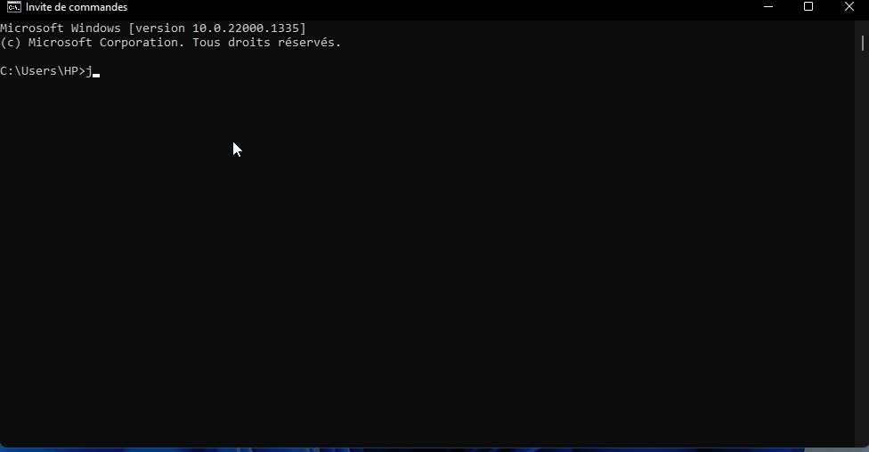

# Moteur de resolution de debat
 
Ce programme permet de mettre en situation le problème de débat à l'aide de la structure de données graphe et le langage Java. 

Si l'utilisateur ne rentre aucun argument en ligne de commande, un premier menu s'affichera et l'utilisateur devra saisir manuellement les arguments et contradictions du débat. 
Dans le cas contraire, un deuxième menu s'affichera si le chemin du fichier saisi par l'utilisateur est valide et le fichier dans le bon format. 

Vous pouvez visualiser le graphe simulant le débat dans les 2 menus. Pour cela, il faut installer GraphViz sur votre machine qui génèrera l'image du graphe dans le chemin que vous aurez saisi.  

#Demo de la saisie manuelle

#Demo de la saisie par fichier 

#Demo de la sauvegarder dans un fichier et la visualisation du graphe par image
![] (Demos/demoImageEtFichierSauvegarde.gif)
